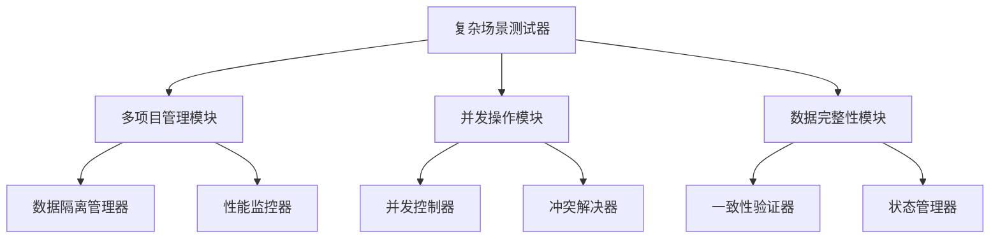
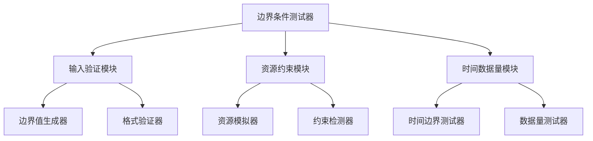
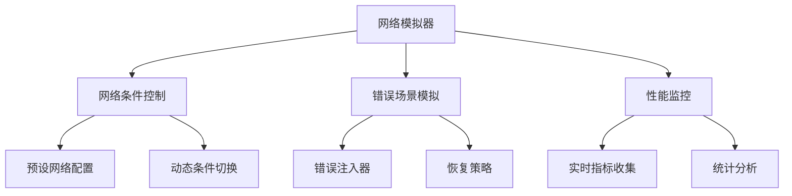
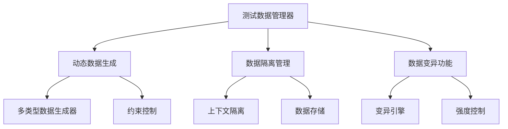
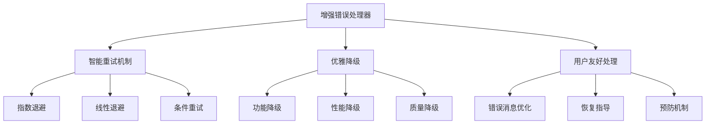

# 01 - 架构总览和设计原则

## 一、核心挑战

闹海AIGC平台自动化测试面临三大核心挑战：

### 1.1 异步长耗时任务
- **视频生成**：1-10分钟不等
- **批量处理**：多任务并发执行
- **状态复杂**：排队/处理/完成/失败

### 1.2 复杂文件处理
- **大文件下载**：资源包几百MB
- **格式校验**：多种媒体格式
- **完整性检查**：文件数量和内容

### 1.3 高频UI变动
- **组件化开发**：元素ID经常变化
- **多版本并行**：不同环境差异
- **国际化需求**：文案多语言支持

## 二、设计原则

### 2.1 分层解耦
```
业务层 → 适配层 → 执行层
   ↓          ↓          ↓
 RF DSL   Python   Playwright
```

### 2.2 新增高级测试层
为了支持复杂场景和边界条件测试，架构新增了以下高级测试组件：

```
高级测试层
├── 复杂场景测试器
│   ├── 多项目管理测试
│   ├── 并发操作测试
│   └── 数据完整性测试
├── 边界条件测试器
│   ├── 输入验证测试
│   ├── 资源约束测试
│   └── 时间数据量测试
├── 网络模拟器
│   ├── 网络条件控制
│   ├── 错误场景模拟
│   └── 性能监控
└── 测试数据管理器
    ├── 动态数据生成
    ├── 数据隔离管理
    └── 数据变异功能
```

### 2.3 资产保护
- 保留现有度量系统
- 复用MCP诊断能力
- 维持CI门禁机制

### 2.4 渐进增强
- 不破坏现有功能
- 逐步引入新特性
- 支持新旧并存

## 五、高级测试架构

### 5.1 复杂场景测试架构



**核心组件**：
- **多项目管理模块**：处理多项目间的数据隔离和切换
- **并发操作模块**：管理并发任务和冲突解决
- **数据完整性模块**：确保复杂操作后的数据一致性

### 5.2 边界条件测试架构



**核心组件**：
- **输入验证模块**：测试各种输入边界条件
- **资源约束模块**：模拟资源受限情况
- **时间数据量模块**：测试时间和数据相关边界

### 5.3 网络模拟架构



**网络条件支持**：
- Normal (正常网络)
- Slow 3G / Fast 3G (3G网络)
- Slow 4G / Fast 4G (4G网络)
- Offline (离线)
- Unstable (不稳定网络)
- Packet Loss (丢包网络)

### 5.4 测试数据管理架构



**数据类型支持**：
- Text (文本数据)
- Number (数值数据)
- Date (日期数据)
- File (文件数据)
- Email (邮箱数据)
- URL (链接数据)

### 5.5 错误处理增强架构



## 三、技术选型依据

| 技术选项 | 优势 | 劣势 | 决策 |
|---------|------|------|------|
| 纯RF Browser | 学习简单 | 无法处理AIGC特性 | ❌ |
| 纯Python Bot | 功能强大 | 门槛高 | ❌ |
| **RF+Python混合** | **兼顾** | **复杂度中等** | ✅ |

## 四、架构价值

### 4.1 业务价值
- **降低门槛**：非技术人员可参与
- **提升效率**：API+UI混合编排
- **减少阻塞**：软门禁机制

### 4.2 技术价值
- **保护投资**：复用现有工程资产
- **增强能力**：解决AIGC特定问题
- **可持续发展**：插件化架构支持扩展